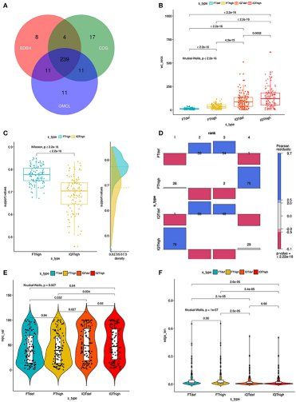

# GET_PHYLOMARKERS

<!--Version Sep 8. 2021.-->

**GET_PHYLOMARKERS** is a software package designed to identify optimal genomic markers for phylogenomics, population genetics and genomic taxonomy. It implements a [**pipeline**](https://vinuesa.github.io/get_phylomarkers/#brief-presentation-and-graphical-overview-of-the-pipeline) to filter orthologous gene clusters computed by the companion package [**GET_HOMOLOGUES**](https://github.com/eead-csic-compbio/get_homologues) to select those with optimal phylogenetic attributes. Top-scoring alignments are concatenated into a supermatrix, which is used to estimate the species tree under the maximum-likelihood (ML) criterion with state-of-the-art fast ML tree searching algorithms. **GET_PHYLOMARKERS** can also estimate ML and parsimony trees from the pan-genome matrix, including unsupervised learning methods to determine the optimal number of clusters from pan-genome and average genomic distance matrices. A detailed [**manual**](https://vinuesa.github.io/get_phylomarkers/#get_phylomarkers-manual) and step-by-step [**tutorials**](https://vinuesa.github.io/get_phylomarkers/#get_phylomarkers-tutorial) document the software and help the user to get quickly up and running. For your convenience, [**html**](https://vinuesa.github.io/get_phylomarkers/) and [**markdown**](https://github.com/vinuesa/get_phylomarkers/blob/master/docs/GET_PHYLOMARKERS_manual.md) versions of the documentation material are available.

## Installation, dependencies and Docker image

For detailed instructions and dependencies please check [**INSTALL.md**](INSTALL.md).

A [**GET_PHYLOMARKERS Docker image**](https://hub.docker.com/r/vinuesa/get_phylomarkers) is available, as well as an [**image bundling GET_PHYLOMARKERS + 
 GET_HOMOLOGUES**](https://github.com/eead-csic-compbio/get_homologues), ready to use. Detailed instructions on setting up the Docker environment are provided in [**INSTALL.md**](INSTALL.md), and how to run container instances with the test sequences distributed with **GET_PHYLOMARKERS** is described in the [**tutorial**](https://vinuesa.github.io/get_phylomarkers/#get_phylomarkers-tutorial).

## Aim
**GET_PHYLOMARKERS** implements a series of sequential filters (detailed below) to selects markers from the homologous gene clusters produced by [GET_HOMOLOGUES](https://github.com/eead-csic-compbio/get_homologues) with optimal attributes for phylogenomic inference. It estimates **gene-trees** and **species-trees** under the **maximum likelihood (ML) optimality criterion** using state-of-the-art fast ML tree searching algorithms. The species tree is estimated from the supermatrix of concatenated, top-scoring alignments that passed the quality filters. 

**GET_HOMOLOGUES** is a genome-analysis software package for microbial pan-genomics and comparative genomics originally described in the following publications: 

- [Contreras-Moreira and Vinuesa, AEM 2013](https://www.ncbi.nlm.nih.gov/pubmed/24096415)
- [Vinuesa and Contreras-Moreira, Meth. Mol. Biol. 2015](https://www.ncbi.nlm.nih.gov/pubmed/25343868) 

More recently we have developed [GET_HOMOLOGUES-EST](https://github.com/eead-csic-compbio/get_homologues), 
which can be used to cluster eukaryotic genes and transcripts, as described in [Contreras-Moreira et al, Front. Plant Sci. 2017](http://journal.frontiersin.org/article/10.3389/fpls.2017.00184/full). 

If GET_HOMOLOGUES_EST is fed both .fna and .faa files of CDS sequences it will produce **identical output to that of GET_HOMOLOGUES and thus can be analyzed with GET_PHYLOMARKERS all the same**.

**GET_PHYLOMARKERS** is primarily tailored towards selecting CDSs (gene markers) to infer DNA-level phylogenies of different species of the same genus or family. It can also select optimal markers for population genetics, when the source genomes belong to the same species.
For more divergent genome sequences, classified in different genera, families, orders or higher taxa,
the pipeline should be run using protein instead of DNA sequences.

## Manual and tutorials

Please, follow the links for a detailed [**manual**](https://vinuesa.github.io/get_phylomarkers/#get_phylomarkers-manual) and [**tutorials**](https://vinuesa.github.io/get_phylomarkers/#get_phylomarkers-tutorial), including a [**graphical flowchart**](https://vinuesa.github.io/get_phylomarkers/#brief-presentation-and-graphical-overview-of-the-pipeline) of the pipeline and explanations of the implementation details.

## Citation.

Pablo Vinuesa, Luz-Edith Ochoa-Sanchez and Bruno Contreras-Moreira (2018).
GET_PHYLOMARKERS, a software package to select optimal orthologous clusters for phylogenomics 
and inferring pan-genome phylogenies, used for a critical geno-taxonomic revision of the 
genus *Stenotrophomonas*. [Front. Microbiol. | doi: 10.3389/fmicb.2018.00771](https://www.frontiersin.org/articles/10.3389/fmicb.2018.00771/abstract) 

Published in the Research Topic on "Microbial Taxonomy, Phylogeny and Biodiversity"
http://journal.frontiersin.org/researchtopic/5493/microbial-taxonomy-phylogeny-and-biodiversity

A [**preprint version is available on bioRxiv**](https://www.biorxiv.org/content/early/2018/04/04/294660)

Code Available at https://github.com/vinuesa/get_phylomarkers and released under the GNU GPLv3 license.

## Developers
The code is developed and maintained by [Pablo Vinuesa](http://www.ccg.unam.mx/~vinuesa/) 
at [CCG-UNAM, Mexico](http://www.ccg.unam.mx/) and 
[Bruno Contreras-Moreira](https://digital.csic.es/cris/rp/rp02661/) 
 at [EEAD-CSIC, Spain](http://www.eead.csic.es/). It is released to the public domain under the GNU GPLv3 [license](./LICENSE).

## Acknowledgements

### Personal
We thank Alfredo J. Hernández and Víctor del Moral at CCG-UNAM for technical support with server administration.

### Funding
We gratefully acknowledge the funding provided by [DGAPA-PAPIIT/UNAM](http://dgapa.unam.mx/index.php/impulso-a-la-investigacion/papiit) (grants IN201806-2, IN211814 and IN206318) and [CONACyT-Mexico](http://www.conacyt.mx/) (grants P1-60071, 179133 and FC-2015-2-879) to [Pablo Vinuesa](http://www.ccg.unam.mx/~vinuesa/), as well as the Fundación ARAID,Consejo  Superior  de Investigaciones Científicas (grant 200720I038 and Spanish MINECO (AGL2013-48756-R) to [Bruno Contreras-Moreira](https://digital.csic.es/cris/rp/rp02661).
