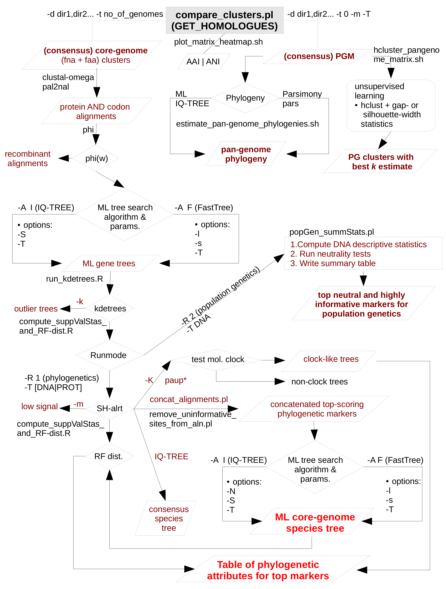
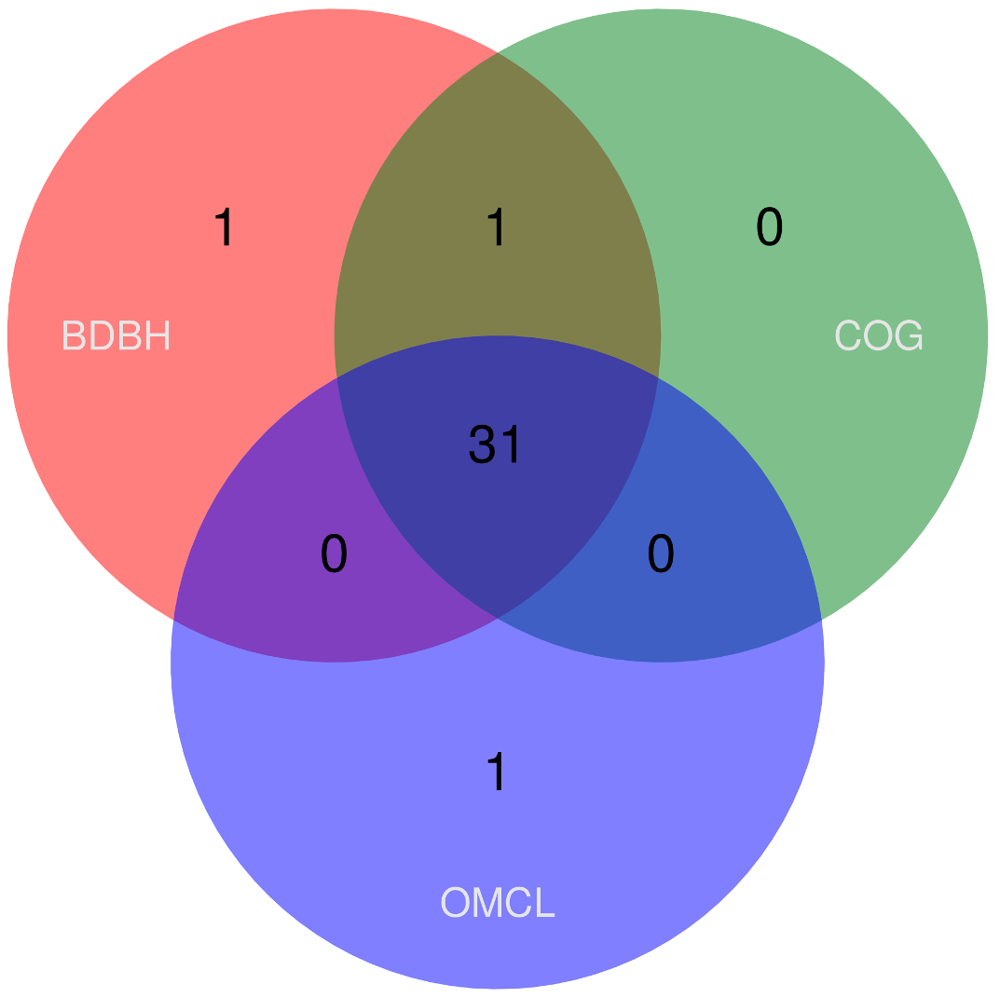
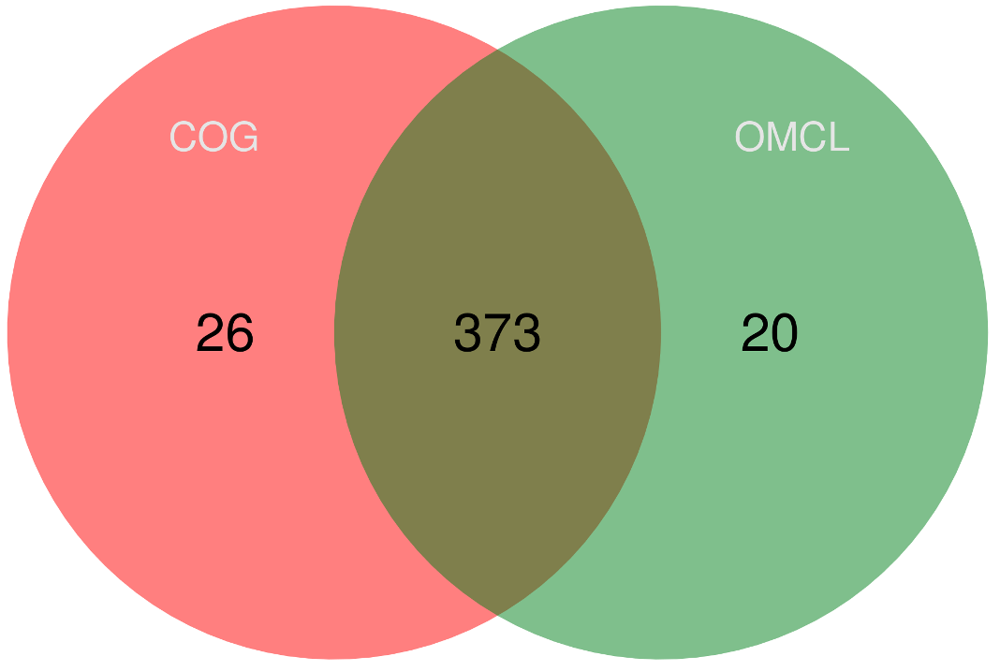
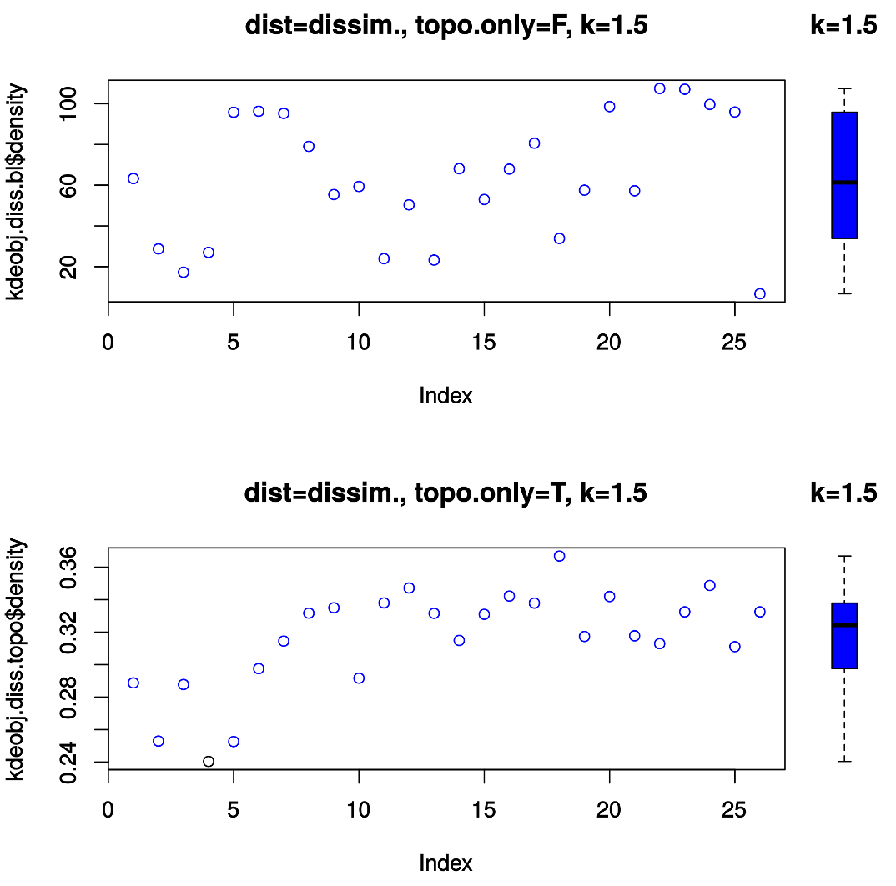
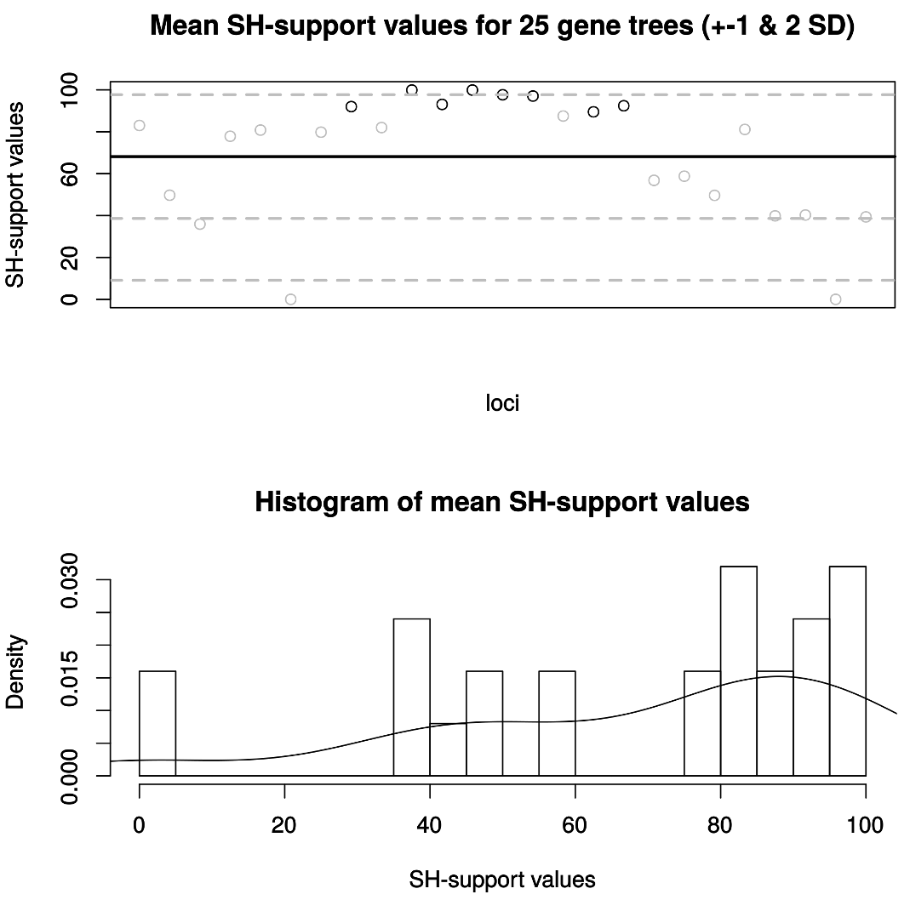
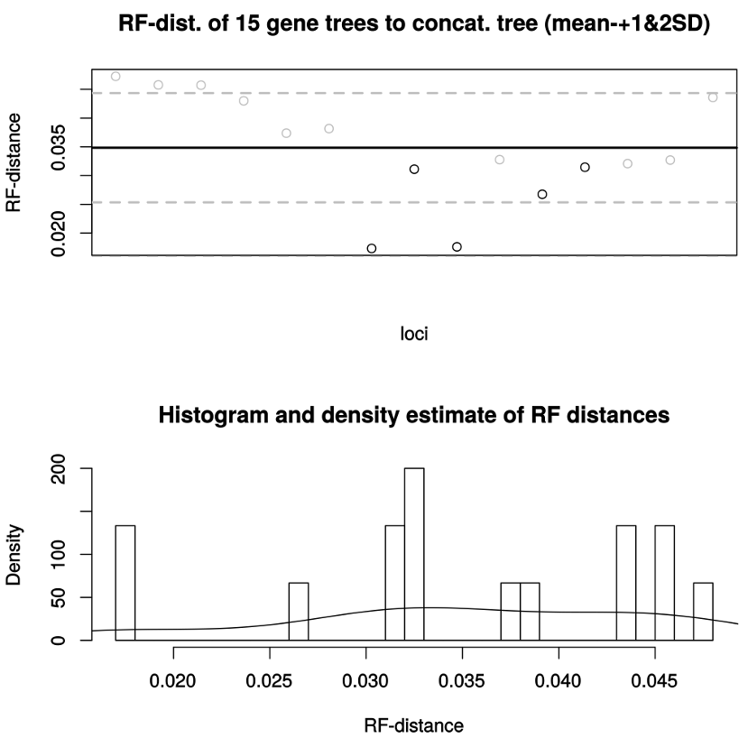
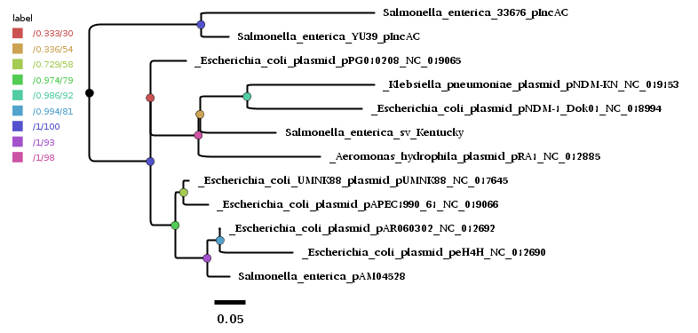

# GET_PHYLOMARKERS MANUAL

## Brief presentation and graphical overview of the pipeline

This manual provides the usage details for **GET_PHYLOMARKERS**, a software package designed to select "well-behaved" phylogenetic markers to estimate a **maximum likelihoood (ML) species tree** from the supermatrix of concatenated, top-scoring alignments. These are identified through a series of sequential filters that operate on orthologous gene/protein clusters computed by **GET_HOMOLOGUES** to exclude:

1. alignments with evidence for **recombinant sequences**
2. sequences that yield "**outlier gene trees**" in the context of the distributions of topologies and tree-lengths expected under the multispecies coalescent
3. **poorly resolved gene trees** 

**Figure 1** provides a graphical overview of the **GET_PHYLOMARKERS** pipeline. The Manual will describe in detail each of these steps along with the options available to the user to control the pipeline's behaviour, the stringency of the filters, as well as the number of substitution models evaluated and tree-search thoroughness. In addition, the script *estimate_pangenome_phylogenies.sh* can search for ML and parsimony **pan-genome phylogenies** using the pan-genome matrix computed by *compare_clusters.pl* from the **GET_HOMOLOGUES** suite, as shown in the **pipeline's flowchart** below.

<!-- -->


<!--</img>-->


## Installation, dependencies and Docker image

The **GET_PHYLOMARKERS** pagacke can be conveniently downloaded as a [**GitHub release**](https://github.com/vinuesa/get_phylomarkers/releases). For detailed instructions on installing the external dependencies please check [**INSTALL.md**](https://github.com/vinuesa/get_phylomarkers/blob/master/INSTALL.md).

A [**Docker image**](https://hub.docker.com/r/csicunam/get_homologues) is available that bundles **GET_PHYLOMARKERS** with [**GET_HOMOLOGUES**](https://github.com/eead-csic-compbio/get_homologues), ready to use. We highly recommend installing the docker image to avoid potential problems with the installation of the many second-party dependencies. If you have not set a Docker environment on your machine, please see the instructions provied in the [**INSTALL.md**](https://github.com/vinuesa/get_phylomarkers/blob/master/INSTALL.md) document for installing Docker on different platforms and downloading/upgrading the [**Docker image**](https://hub.docker.com/r/csicunam/get_homologues/) from Docker hub.

## Aim
**GET_PHYLOMARKERS** implements a series of sequential filters (**Fig. 1** and explained below) to selects markers from the homologous gene clusters produced by [**GET_HOMOLOGUES**](https://github.com/eead-csic-compbio/get_homologues) with optimal attributes for phylogenomic inference. It estimates **gene-trees** and **species-trees** under the **maximum likelihood (ML) optimality criterion** using *state-of-the-art* fast ML tree searching algorithms. The species tree is estimated from the supermatrix of concatenated, top-scoring alignments that passed the quality filters (Fig. 1). The stringency of these filters and the thoroughness of the ML tree searches can be controlled by the user, although sensible defaults are provided, making it an easy-to-use, **user-friendly software**.

**GET_HOMOLOGUES** is a genome-analysis software package for microbial pan-genomics and comparative genomics originally described in the following publications: 

- [Contreras-Moreira and Vinuesa, AEM 2013](https://www.ncbi.nlm.nih.gov/pubmed/24096415)
- [Vinuesa and Contreras-Moreira, Meth. Mol. Biol. 2015](https://www.ncbi.nlm.nih.gov/pubmed/25343868) 

More recently we have developed [**GET_HOMOLOGUES-EST**](https://github.com/eead-csic-compbio/get_homologues), 
which can be used to cluster eukaryotic genes and transcripts, as described in [Contreras-Moreira et al., 2017](http://journal.frontiersin.org/article/10.3389/fpls.2017.00184/full).

**GET_PHYLOMARKERS** is primarily tailored towards selecting CDSs (gene markers) to infer DNA-level phylogenies of different species of the same genus or family. It can also select optimal markers for population genetics, when the source genomes belong to the same species.
For more divergent genome sequences, classified in different genera, families, orders or higher taxa,
the pipeline should be run using protein instead of DNA sequences.

## Usage synopsis

1. [The pipeline (Fig. 1)](GET_PHYLOMARKERS_manual.md#brief-presentation-and-graphical-overview-of-the-pipeline) is run by executing the main script *run_get_phylomarkers_pipeline.sh* inside a folder containing twin \*.fna and \*.faa FASTA files for orthologous **single-copy** CDSs and translation products (Fig. 1). <!-- computed by the *get_homologues.pl -e* or *compare_clusters.pl* -t number_of_genomes scripts of the **GET_HOMOLOGUES** suite.-->
2. There are two **runmodes**: **-R 1** (for phylogenetics) and **-R 2** (for population genetics).
3. The pipeline can be run on two **molecular types**: **DNA** or **protein** sequences (**-t DNA|PROT**). The latter is intended for the analysis of more divergent genome sequences, typically above the genus level.
4. From version 2.0 onwards, **GET_PHYLOMARKERS** uses either the **FastTree (FT)** or **IQ-TREE (IQT)** fast ML tree search algorithms, controlled with the **-A [F|I]** option [**default: I**], respectively. Note that previous versions of the pipeline used FT as the default search algorithm. This change is based on our benchmark analyses [(Vinuesa et. al, 2018. Submitted)](GET_PHYLOMARKERS_manual.md#citation), which showed that IQ-TREE systematically finds better-scoring trees which allowed for a finer-grained filtering of markers based on their phylogentic attributes. This is in line with a recent publication that concluded that IQT is the best ML tree-searching algorithm available to date for datasets in the range of 100-200 sequences, as demonstrated in a large benchmark study with empirical phylogenomic datasets (Zhou et al. 2017. Mol Biol Evol. Nov 21. doi: 10.1093/molbev/msx302.) [PMID:29177474](https://www.ncbi.nlm.nih.gov/pubmed/29177474).
5. As of version 2.0 (January, 22cnd, 2018), GET_PHYLOMARKERS uses IQ-TREE version 1.6.1 (released Dec. 28th, 2017) which implements a fast search option, which almost matches the speed of FastTree, but retaining the accuracy of IQ-TREE 1.5.* Model-selection is performed with the **-fast flag** to for maximal speed both for gene- and species tree searches.
6. The **global molecular-clock hypothesis** can be evaluated for DNA (codon) alignments (-R 1 -t DNA -K). It is not yet implemented for protein sequences.
7. **GET_PHYLOMARKERS** can compute **basic descritive statistics of population DNA polymorphisms and neutrality tests** when run in popGen mode (**-R 2**). 
8. A **small sequence dataset is provided** with the distribution in the test_sequences/ directory for easy and fast testing of the pipeline (~16-60 seconds on a commodity GNU/Linux desktop machine with 4 cores; see [**GET_PHYLOMARKERS tutorial**](GET_PHYLOMARKERS_manual.md#get_phylomarkers-tutorial), depending on the search thoroughness and/or nuber of models to be evaluated). 

### Basic usage examples

```
 # default run: launches the IQT-based filtering pipeline, selecting best models for gene trees and fitting GTR+RATE_AND_F_PARAMS models for species tree search based on the supermatrix.
 run_get_phylomarkers_pipeline.sh -R 1 -t DNA

 # Same as above, but adding molecular-clock analysis assuming a HKY85+G substitution model                
 run_get_phylomarkers_pipeline.sh -R 1 -t DNA -K -M HKY

 # population-genetics mode   
 run_get_phylomarkers_pipeline.sh -R 2 -t DNA                
 
 # protein alignments, user-defined kdetrees & mean branch support cut-off values
 run_get_phylomarkers_pipeline.sh -R 1 -t PROT -k 1.2 -m 0.7 

 # To run the pipeline on a remote server, we recommend using the nohup command upfront, as shown below:
 #  in this case, calling also IQ-TREE, which will select among the (HKY,TN,TVM,TIM,SYM,GTR)+RATE models 
 #  and do 5 independent tree searches under the best-fit model, computing ultrafast bootstrapp 
 #  and aproximate Bayes branch support values 
 nohup run_get_phylomarkers_pipeline.sh -R 1 -t DNA -S 'HKY,TN,TVM,TIM,SYM,GTR' -k 1.0 -m 0.7 -T high -N 5 &> /dev/null &
```

### Basic usage notes

1. Start the run from within the directory holding core gene clusters generated by either *get_homologues.pl -e* or 
subsequent consensus (intersection OMCL,COGS,BDBH) clusters produced with *compare_clusters.pl -t number_of_genomes* from the 
[**GET_HOMOLOGUES**](https://github.com/eead-csic-compbio/get_homologues) package, as shown in the [**GET_PHYLOMARKERS tutorial**](GET_PHYLOMARKERS_manual.md#get_phylomarkers-tutorial).
   
  NOTE: **both .faa and .fna files are required** to generate codon alignments from DNA fasta files. This
            means that two runs of *compare_clusters.pl* (from the **GET_HOMOLOGUES** package) are required,
	          one of them using the -n flag [**GET_PHYLOMARKERS tutorial**](GET_PHYLOMARKERS_manual.md#get_phylomarkers-tutorial. 
	    
2. *run_get_phylomarkers_pipeline.sh* is intended to run on a collection of **single-copy** sequence clusters from 
different species or strains.

   NOTES: an absolute minimum of 4 distinct haplotypes per cluster are required
        for the cluster to be evaluated. Clustes with < 4 haplotypes are automatically
	      discarded. This means that at least 4 distinct genomes should be used as input.
	      However, the power of the pipeline for selecting optimal genome loci 
     	  for phylogenomics improves when a larger number of genomes are available 
     	  for analysis. Reasonable numbers lie in the range of 10 to 200 clearly
     	  distinct genomes from multiple species of a genus, family, order or phylum.
     	  The pipeline may not perform satisfactorily with too distant genome sequences,
     	  particularly when sequences with significantly distinct nucleotide or aminoacid
     	  compositions are used. This type of sequence heterogeneity is well known to 
     	  cause systematic bias in phylogenetic inference.

## On the filtering criteria 

*run_get_phylomarkers_pipeline.sh* uses a **hierarchical filtering scheme**, summarized in [Fig. 1](GET_PHYLOMARKERS_manual.md#brief-presentation-and-graphical-overview-of-the-pipeline) and detailed below:

### Detection of recombinant loci 

Codon or protein alignments (depending on runmode) are first screened with **Phi-test** 
([Bruen et al. 2006](http://www.genetics.org/content/172/4/2665.long)) for the presence of potential recombinant sequences (Fig. 1). It is a well established fact that recombinant sequences negatively impact phylogenetic inference when using algorithms that do not account for the effects of this evolutionary force. The permutation test with 1000 permutations is used to compute the *p*-values. These are considered significant if *p* < 0.05. Some loci may not contain sufficient polymorphisms for the test to
work. In that case, the main script assumes that the locus does not contain recombinant sites, but prints a warning message to screen and to the run's logfile.
 
### Detection of trees deviating from expectations of the (multispecies) coalescent.

The next filtering step (Fig. 1) is provided by the **kdetrees-test**, which checks the distribution of topologies, tree lengths and branch lengths. *kdetrees* is a non-parametric method for estimating distributions of phylogenetic trees 
([Weyenberg et al. 2014](https://academic.oup.com/bioinformatics/article-lookup/doi/10.1093/bioinformatics/btu258)), 
with the goal of identifying trees that are significantly different from the rest of the trees in the sample, based on the analysis of topology and branch length distributions. Such **"outlier trees"** may arise for example from horizontal gene transfers or gene duplication (and subsequent neofunctionalization) followed by differential loss of paralogues among lineages. Such processes will cause the affected genes to exhibit a significantly deviating phylogeny from that displayed by the majority of genes, which are expected to be generated by the  (multispecies) coalescent as species or populations diverge. Alignments producing significantly deviating trees in the kdetrees test are identified and saved in the kde_outliers/ directory. The corresponding alignments are not used in downstream analyses.

```      
      * Parameter for controlling kdetrees stingency:
      -k <real> kde stringency (0.7-1.6 are reasonable values; less is more stringent)
     			       [default: 1.5]
```

### Phylogenetic signal content

The alignments passing the two previous filters [Fig. 1](GET_PHYLOMARKERS_manual.md#brief-presentation-and-graphical-overview-of-the-pipeline) are subjected to **maximum likelihood (ML) tree searches** with **FastTree** or **IQ-TREE** (default) to 
infer the corresponding ML gene trees. Their **phylogenetic signal is computed from the Shimodaria-Hasegawa-like likelihood ratio test branch support values**, which vary between 0-1, as we have reported previously ([Vinuesa et al. 2008](http://aem.asm.org/content/74/22/6987.long)). The support values of each internal branch or bipartition are parsed to compute the mean support value for each tree.
**Alignments/Trees with a mean support value below a cutoff threshold are discarded**.

```
      * Parameters controlling filtering based on mean support values.
      -m <real> min. average support value (0.7-0.8 are reasonable values) 
     		for trees/loci to be selected as informative [default: 0.75]
```

### Evaluating the global molecular clock hypothesis.

*run_get_phylomarkers_pipeline.sh* calls the auxiliary script *run_parallel_molecClock_test_with_paup.sh*
to evaluate the **global molecular clock hypothesis** on the top markers, selected according to the criteria explained in the three previous
sections. The script calls [paup*](https://people.sc.fsu.edu/~dswofford/paup_test/) 
to evaluate the free-rates and clock hypothesis using likelihood ratio tests computed with R. Currently this is only performed on codon alignments. Future versions may implement the global clock hypothesis test also for protein alignments.

### On tree searching: 
#### ModelFinder + IQ-TREE searches:
As of version 1.9.9.0_22Dec17, **GET_PHYLOMERKERS** implements the **-A I** option, which calls [**IQ-TREE**](http://www.iqtree.org/) for ML tree searching [**Nguyen et. al (2015)**](https://academic.oup.com/mbe/article/32/1/268/2925592). This is the most recent fast ML software on the scene, which was developed with the aim of escaping from early local maxima encountered during "hill-climbing" by generating multiple seed trees to initiate tree searches, maintaining a pool of candidate trees during the entire run. Overall, it was the best-performing ML tree search algorithm among those evaluated by [Zhou et al. (2017)](https://www.ncbi.nlm.nih.gov/pubmed/29177474) in their above-mentioned benchmarking paper, at least for datasets < 200 taxa. For larger datasets (several hudreds to thousands of sequences), current implementations of RAxML and ExaML, which make heavy use of SPR-moves, may outperform IQ-TREE, which makes more intensive use of local NNI-moves. 

- Our benchmark analyses have shown that [IQ-TREE](http://www.iqtree.org/) (v1.6.1) [Nguyen et. al (2015)](https://academic.oup.com/mbe/article/32/1/268/2925592) runs quickly enough when the **-fast** flag is passed to make it feasible to include a model selection step using  [ModelFinder](http://www.iqtree.org/ModelFinder/) [(Kalyaanamoorthy et al. 2017)](https://www.nature.com/articles/nmeth.4285) withouth incurring in excessively long computation times. 

- Combined with its superior tree-searching algorithm allows IQT to rank as the clear winner in our benchmarks. Therefore, **from version 2.0 onwards, *GET_PHYLOMARKERS* uses IQT as its default tree searching algorithm**, both for the estimation of gene-trees and the species-tree (from the concatenated, top-scoring alignments).

- All **gene tree searches are run in parallel** under the modelset with the following parameters: -mset XXX -m MFP -nt 1 -alrt 1000 -fast

- To keep computation times within reasonable bounds, the number of models evaluated by ModelFinder (integrated in IQ-TREE) differ for the gene-tree and species-tree search phases, as shown below: 

```
# IQT gene tree searches (hard-coded): -T <high|medium|low|lowest> [default: medium]

- high:   -m MFP -nt 1 -alrt 1000 -fast

- medium: -mset K2P,HKY,TN,TNe,TIM,TIMe,TIM2,TIM2e,TIM3,TIM3e,TVM,TVMe,GTR

- low:	   -mset K2P,HKY,TN,TNe,TVM,TVMe,TIM,TIMe,GTR

- lowest: -mset K2P,HKY,TN,TNe,TVM,TIM,GTR


# IQT species-tree searches on the supermatrix: 

	      -S <string> quoted 'comma-separated list' of base models to be evaluated by IQ-TREE
	         when estimating the species tree from the concatenated supermatrix.
	         
# If no -S is passed, then sinlge default models are used, as shown below:


 - for DNA alignments [default: GTR]

  <'JC,F81,K2P,HKY,TrN,TNe,K3P,K81u,TPM2,TPM2u,TPM3,TPM3u,TIM,TIMe,TIM2,TIM2e,TIM3,TIM3e,TVM,TVMe,SYM,GTR'>  
     
 - for PROT alignments [default: LG]

   <'BLOSUM62,cpREV,Dayhoff,DCMut,FLU,HIVb,HIVw,JTT,JTTDCMut,LG,mtART,mtMAM,mtREV,mtZOA,Poisson,PMB,rtREV,VT,WAG'>          
```
                
- In addition, if **-T high**, *run_get_phylomarkers_pipeline.sh* will launch -N <integer> [default: 5] independent IQT searches on the supermatrix of concatenated top-scoring markers.

- After selecting the best substitution model, which includes taking care of among-site rate variation, IQ-TREE will search for the best tree, including bootstrapping with the **UFBoot2 ultrafast bootstrapping algorithm** [(Hoang et al. 2017)](https://www.ncbi.nlm.nih.gov/pubmed/29077904) and estimation of **approximate Bayes branch support values**. 

##### Example *run_get_phylomarkers_pipeline.sh* invocations to perform IQ-TREE searches. 
Note that as of version 1.9.10 (January 1st, 2018), the script calls IQ-TREE 1.6.1 with the **-fast flag** enabled for maximal speed.

```    
# 1. Default IQ-TREEE run (-T medium), evaluating the corresponding set models during gene-tree searches and evaluating the base GTR model  on the concatenated DNA supermatrix, using a single search
run_get_phylomarkers_pipeline.sh -R 1 -t DNA

# 2. Run 10 independent IQ-TREEE runs on a concatenated DNA supermatrix, evaluating the TN,TIM,TVM,GTR base models
run_get_phylomarkers_pipeline.sh -R 1 -t DNA -S 'TN,TIM,TVM,GTR' -k 0.9 -m 0.8 -T high -N 10 &> /dev/null &

# 3. Run 5 independent IQ-TREEE runs on a concatenated PROT supermatrix, evaluating the LG,WAG,JTT matrices 
run_get_phylomarkers_pipeline.sh -R 1 -t PROT -A I -S 'LG,WAG,JTT,VT' -k 1.0 -m 0.7 -T high -N 5 &> /dev/null &
 
# 4. To run the pipeline on a remote server, we recommend using the nohup command upfront, as shown below:
nohup run_get_phylomarkers_pipeline.sh -R 1 -t DNA -S 'HKY,TN,TVM,TIM,SYM,GTR' -k 1.0 -m 0.7 -T high -N 5 &> /dev/null &	  

```

#### FastTree searches:
- *run_get_phylomarkers_pipeline.sh* performs tree searches using the [**FastTree**](http://microbesonline.org/fasttree/) program ([Price et al. 2010](http://journals.plos.org/plosone/article?id=10.1371/journal.pone.0009490)) when invoked with the **-A F** parameter. 
- This program implements many heuristics tailored towards improving the cpu time and memory usage, making it the fastest ML tree searching program that is currently available. However, this comes at a price: in a recent comprehensive benchmark analysis of fast ML phylogenetic programs using large and diverse phylogeneomic datasets, FastTree was shown to be the worst-scoring one in regard to lnL values and topological accuracy [(Zhou et al. 2017)](https://www.ncbi.nlm.nih.gov/pubmed/29177474). 
- However, given its outstanding speed, low RAM requirements, acceptance of DNA and protein sequence alignments and on-the-fly computation ofthe above-mentioned Shimodaria-Hasegawa-like likelihood ratio test of branch support, **we recommend it for fast exploration of large datasets, but not for final analyses**.
- A clear limitation of FT is that it implements only very few substitution models. However, for divergent sequences of different species within a bacterial taxonomic genus or family, our experience has shown that almost invariably the GTR+G model is selected by jmodeltest2 when large datasets with base frequency heterogeneity are used. The GTR+G+CAT is the substitution model used by *run_get_phylomarkers_pipeline.sh* 
calls of FastTree on codon alignments. 
- To maximize accuracy, it is important to **compile FastTree with double precission enabled** in order to obtain the highest *lnL* scores possible. This is particularly critical when highly similar sequences are present in the dataset.
- To further enhance accuracy, the gene trees are computed by performing a thorough tree search, hardcoded in the following default (-T medium) FastTree call, which performs a significantly more intense tree search than the default setting used by [Zhou et al. (2017)](https://www.ncbi.nlm.nih.gov/pubmed/29177474). 

```      
     	-nt -gtr -gamma -bionj -slownni -mlacc 3 -spr 4 -sprlength 10 
```    

- For gene tree searches, and particularly for concatenated codon alignments, which may take a considerable time (up to several hours) or
for large datasets (~ 100 taxa and > 300 concatenated genes) the user can choose to run FastTree with different **levels of tree-search thoroughness**: high|medium|low|lowest 

```      
      high:   -nt -gtr -gamma -bionj -slow -slownni -mlacc 3 -spr 8 -sprlength 10
      medium: -nt -gtr -gamma -bionj -slownni -mlacc 3 -spr 4 -sprlength 10 
      low:    -nt -gtr -gamma -bionj -slownni -spr 4 -sprlength 10 
      lowest: -nt -gtr -gamma -mlnni 4
```      
where '-s spr' and '-l spr_length' can be set by the user. The lines above show their default values.
      
- For protein alignments, the search parameters are the same, only the model changes to lg

```      
      high: -lg -gamma -bionj -slow -slownni -mlacc 3 -spr 4 -sprlength 10
```

##### Example invocations for FastTree searches

```
# FastTree searching on a huge protein dataset for fast inspection
run_get_phylomarkers_pipeline.sh -R 1 -A F -t PROT -m 0.6 -k 1.0 -T lowest


# FastTree searching on DNA dataset using the most through possible search and extensive spr rounds
run_get_phylomarkers_pipeline.sh -R 1 -A F -t DNA -m 0.7 -k 1.0 -T high -s 20 -l 12

```

## Credits and references
GET_PHYLOMARKERS is designed, created and maintained at the Center for Genomic Sciences of Universidad Nacional Autónoma de México [(CCG/UNAM)](http://www.ccg.unam.mx/~vinuesa/) and the Laboratory of Computational Biology at Estación Experimental de Aula [Dei/CSIC](http://www.eead.csic.es/compbio/) in Zaragoza (Spain).  

The pipeline code and accessory scripts were written Pablo Vinuesa and Bruno Contreras-Moreira, making use of the  third party code libraries and binaries listed below. Please refer to [INSTALL.md](https://github.com/vinuesa/get_phylomarkers/blob/master/INSTALL.md) for installation instructions.

### Third-party binaries distributed with GET_PHYLOMARKERS
* [clustal omega](http://www.clustal.org/omega/). Multiple sequence alignment software. [Sievers et al. 2011](http://msb.embopress.org/content/7/1/539.long). On Ubuntu try: 'sudo apt-get install clustalo'
* [parallel](https://www.gnu.org/software/parallel/). Executes processes in parallel on multicore machines.
* [Phi test](https://www.maths.otago.ac.nz/~dbryant/software/PhiPack.tar.gz). Recombination test software. [Bruen et al. 2006](http://www.genetics.org/content/172/4/2665.long)
* [FastTree](http://microbesonline.org/fasttree/): Fast maximum-likelihood tree searching program. [Price et al. 2010](http://journals.plos.org/plosone/article?id=10.1371/journal.pone.0009490). 
* [ModelFinder](http://www.iqtree.org/ModelFinder/): Fast model selection for accurate phylogenetic estimates. [(Kalyaanamoorthy et al. 2017)](https://www.nature.com/articles/nmeth.4285)
* [IQ-TREE](http://www.iqtree.org/). Highly accurate maximum-likelihood tree searching program. [Nguyen et. al (2015)](https://academic.oup.com/mbe/article/32/1/268/2925592). [paup*](https://people.sc.fsu.edu/~dswofford/paup_test/). Multipurpose phylogenetics software package developed by David Swofford and colleagues. NOTE: This is a test version that expires every 6 months! So please update regularly.
* pars, seqboot and consense from Joe Felsenstein's [PHYLIP](http://evolution.genetics.washington.edu/phylip.html) package.
* nw_reroot and nw_support from the [Newick utilities](http://bioinformatics.oxfordjournals.org/cgi/content/abstract/btq243v1) package.
* you may also need to install [**bc**](https://www.gnu.org/software/bc/),an arbitrary-precision language for performing math calculations with Bash and other shells


### Perl modules
- [File::Rename](http://search.cpan.org/~rmbarker/File-Rename-0.06/rename.PL)

From the [BioPerl](http://bioperl.org/) suite: 

- Bio::AlignIO;
- Bio::PopGen::IO
- Bio::PopGen::Utilities
- Bio::PopGen::Statistics
- Bio::SeqIO;
  
### R packages
- [ape](https://cran.r-project.org/web/packages/ape/index.html)
- [kdetrees](https://cran.r-project.org/web/packages/kdetrees/index.html)
- [stingr](https://cran.r-project.org/web/packages/stringr/index.html)
- [vioplot](https://cran.r-project.org/web/packages/vioplot/index.html)
- [ggplot2](https://cran.r-project.org/web/packages/ggplot2/index.html)
- [gplots]((https://cran.r-project.org/web/packages/gplots/index.html))
- [dplyr](https://cran.r-project.org/web/packages/dplyr/index.html)
- [seqinr](https://cran.r-project.org/web/packages/seqinr/index.html)


***

# GET_PHYLOMARKERS TUTORIAL

## Test datasets
The **GET_PHYLOMARKERS** distribution provides a **test_sequences/** directory which holds the subdirectories **core_genome/**, **pan_genome/** and **pIncAC/**. The first one contains **\*.fna** and **\*.faa** FASTA files with the **consensus (BDBH, COGtriangles and OMCL) core-genome clusters** computed with **GET_HOMOLOGUES** from a set of 12 GenBank-formatted pIncA/C plasmids,provided in the pIncAC/ directory. The second one holds the **pan-genome matrix** computed by *compare_clusters.pl* from the **GET_HOMOLOGUES** suite in tabular (\*.tab), FASTA (\*.fasta) and phylip (\*.phy) formats. The **pIncAC/** directory holds the source \*.gbk GenBank files. This directory has a README.txt file that briefly describes the GenBank files.

These directories allow you to:

- Rapidly test the GET_PHYLOMARKERS suite working on core-genome orthologous clusters (core_genome/)

- Rapidly test the GET_PHYLOMARKERS suite working on the pan-genome matrix (pan_genome/)

- Run the comlete GET_HOMOLOGUES + GET_PHYLOMARKERS pipelines from scratch (pIncAC/)

The first section below will first show how to share data between the host (your) machine and the **GET_HOMOLOGUES + GET_PHYLOMARKERS Docker container**.

The following ones provide code examples on how to run the full **GET_HOMOLOGUES** + **GET_PHYLOMARKERS** pipelines using the test sequences.

## How to share data between the host (your) machine and the **GET_HOMOLOGUES + GET_PHYLOMARKERS Docker container**
1. Decide a suitable place on your file system to put the projects and associated sequence data that you will analyze with the **GET_HOMOLOGUES + GET_PHYLOMARKERS** software suites, and create a top directory to hold your projects in subdirectories

```
# for example at your home directory
cd # takes you home

# make the directory
mkdir get_homPhy 

```
2. Copy the test_sequences directory from the distribution into $HOME/get_homPhy

```
cp -r ~/path2your/github/get_phylomarkers/test_sequences/ get_homPhy/

# grant write permissions to all users
# this is required for the container to get access to the directory and write results to it
chmod -R a+w get_homPhy

```
3. With that directory in place, the command to deploy the container 
  (attaching the host directory to the container volume located at the $HOME/get_homPhy 
  directory within the container) would be:

```
docker run --rm -d -P --name get_homPhy -v $HOME/get_homPhy:/home/you/get_homPhy -it csicunam/get_homologues:latest /bin/bash

```
You should be presented with the container ID (a3ba1460d5e40af32fb8223c8bd17a725ea05b760d145f4001d23f33b47bef01). Make note of the first four characters for the next step.


4. Finally, we need to attach the Docker's ID to gain shell access to the running container. Just copy the first 4 characters

```
# Attach local standard input, output, and error streams to a running container
docker attach  a3ba

```
That's it, now we can work within our get_homPhy directory usint the Ubuntu-Linux environment provided by the container, which also contains all the code required to run **GET_HOMOLOGUES** and **GET_PHYLOMARKERS**. Before getting our hands dirty, lets have a look at the container's environment.

### Exploring the container's environment

```
# >>> Now you are running in the container! 
        Lets explore its environment <<<  

# What type of OS is the Docker running?
you@b15c0ab109e3:~/get_homPhy/test_sequences/core_genome$ echo $OSTYPE
linux-gnu

# Give me more details of the OS
you@b15c0ab109e3:~/get_homPhy/test_sequences/core_genome$ uname -a
Linux b15c0ab109e3 4.4.0-112-generic #135-Ubuntu SMP Fri Jan 19 11:48:36 UTC 2018 x86_64 GNU/Linux

# What directories are contained in the search $PATH ?
you@b15c0ab109e3:~/get_homPhy/test_sequences/core_genome$ echo $PATH
/get_phylomarkers:/get_homologues:/usr/local/sbin:/usr/local/bin:/usr/sbin:/usr/bin:/sbin:/bin

# How many processors does this host provide for parallel computations?
you@b15c0ab109e3:~/get_homPhy/test_sequences/core_genome$ grep -c ^processor /proc/cpuinfo
4

# What shell is the conatiner running?
you@b15c0ab109e3:~/get_homPhy/test_sequences/core_genome$ echo $SHELL
/bin/bash

# What Bash version is it?
you@b15c0ab109e3:~/get_homPhy/test_sequences/core_genome$ echo $BASH_VERSION
4.4.12(1)-release

```

### Exploring the file system
In this section we will navigate through the file system to get familiar with the structure and contents of the Docker's container.

```
# 1. In which directory of the file system are we standing at?
you@a3ba1460d5e4:~$ pwd
/home/you

# 2. list directories
you@a3ba1460d5e4:~$ ls
get_homPhy

# 3. list the contents of the root directory /
you@a3ba1460d5e4:~$ ls /
bin boot dev etc get_homologues get_phylomarkers home lib ...

# 4. list contents of the get_homologues and get_phylomarkers directories
you@a3ba1460d5e4:~$ ls /get_homologues/
you@a3ba1460d5e4:~$ ls /get_phylomarkers/

# 5.1 listing the contents of the /bin directory reveals that we have a powerful 
#    Linux toolset at hand, including interpreted programming languages like awk, bash, perl, R,
#    editors like vim, diverse compilers ... 
you@a3ba1460d5e4:~$ perl -e 'print "Hello world\n";'

# IMPORTANT NOTE: THE CONTAINER DOES NOT PROVIDE A GRAPHICAL ENVIRONMENT (X-windows system)
#  More on this topic later. 

# 5.2 let's have a peak at the sequence data in test_sequences/
you@a3ba1460d5e4:~$ cd get_homPhy/test_sequences

you@a3ba1460d5e4:~/get_homPhy/test_sequences$ ls
core_genome  pan_genome  pIncAC

# 5.3 list the contents of each directory recursively
you@a3ba1460d5e4:~/get_homPhy/test_sequences$ ls -R

# 6. cd into core_genome and list contents
cd core_genome && ls

# 6.1 How many faa and fna files are there?
ls *.faa | wc -l
ls *.fna | wc -l

# 6.1 How many sequences are in each faa file and provide a summary for the fna files
grep -c '>' *faa 
grep -c '>' *fna | cut -d: -f2 | sort | uniq -c

# 7. let's have a look at the files
head -2 1962_DNA_topoisomerase_II...fna
grep '>' head -2 1962_DNA_topoisomerase_II...fna

# 8. Finally let's return to the /home/you/get_homPhy directory to proceed with the GET_HOMOLOGUES and GET_PHYLOMARKERS tutorials
you@a3ba1460d5e4:~$ cd ~/get_homPhy/

# 8.1 It's important to note and remember that you can write output in ~/get_homPhy/ 
#    and any subdirectory below it and acces the contents from your host machine. 
#    The data written to disk are parmanent and shared between the Docker container
#    and the host. Let's demonstrate it
you@b16d93c02c9a:~/get_homPhy$ cat date_stamp.txt
you@b16d93c02c9a:~/get_homPhy$ ls
date_stamp.txt  test_sequences
you@b16d93c02c9a:~/get_homPhy$ cat date_stamp.txt
Sun Feb  4 02:11:41 UTC 2018

# Note that the time stamp will most likely not correspond to that of the host machine.
# This can be configured, as shown for example in this blog
# https://www.ivankrizsan.se/2015/10/31/time-in-docker-containers/

# Now open a terminal or the filesystem's browser of the host machine and navigate to 
# /home/you/get_homPhy directory to confirm that you can see the date_stamp.txt
# file that we have just generated.

# That's it, congratulations! You have permanently shared a parent directory
# and their childs between the host and your GET_HOMOLOGUES+GET_PHYLOMARKERS Docker container.
# You are all set to start working with your own data or the test sequences provided with
# the GET_PHYLOMARKERS distribution for the tutorials that folow.

```

The preceding section should have provided you with a reasonable overview of the container's environment and file system. It should have also convinced you that you have a powerful Linux toolset at hand to explore and process your data in different ways in a standard shell (Bash) environment.

Let's proceed now with the **GET_HOMOLOGUES**  and **GET_PHYLOMARKERS** tutorials.

## Computing a consensus core-genome with GET_HOMOLOGUES

If you are not running in the Docker container, go (cd) into the distribution directory and cd into the subidrectory test_sequences/ and issue the commands shown below.

If you launched a Docker container, and assuming that you followed the Docker tutorial presented in the previous section, just make sure that you are in ~/get_homPhy/.

```
# 1. cd into the directory holding the test_sequences
cd test_sequences/
ls # will list the following directories: core_genome/, pan_genome/ and pIncAC/

# 2. run GET_HOMOLOGUES to compute the set of homologous clusters using the BDBH, COGtriangles and OMCL clustering algorithms 
get_homologues.pl -d pIncAC -t 12 -e -n 1  # BDBH clusters containing sequences for the 12 genomes, 
                                           # excluding those with inparalogues (-e): 33 clusters found.
                                           # Takes 330 wallclock secs on a comodity desktop with 
                                           # Intel Core2 Quad CPU Q9400 @ 2.66GHz x 1 cores
# if you want, you can suspend the job and put it to the background
CTRL-Z
bg

# and run the top command to see the processes running
top

# hit q to quit monitoring the processes running on your system (docker or host) with the top command

# Now cluster sequences using the COGtriangles algorithm
get_homologues.pl -d pIncAC -G -t 0        # COGtriangles, computing clusters of all sizes (-t 0)
                                           # finds 408 clusters in 14 wallclock secs, as it recycles
                                           # the blast results of the previous run.
get_homologues.pl -d pIncAC/ -M -t 0       # OMCL, finds 393 clusters in 5 wallclock secs.

```

## Computing a consensus core-genome with GET_HOMOLOGUES
To learn all details around running GET_HOMOLOGUES, please read the online [**GET_HOMOLOGUES manual**](http://eead-csic-compbio.github.io/get_homologues/manual/)

```
# Compute consensus core-genome clusters using compare_clusters.pl of the GET_HOMOLOGUES suite.
# Note that we run the script twice, once with the -n flag 
# (to compute the consesus clusters at the DNA level, producing *.fna files)
# and a second instance without the flag, to get the protein clusters (*.faa files)

cd pIncAC_homologues/
find . -type d

compare_clusters.pl -d ./KlebsiellapneumoniaeplasmidpNDM-KNNC019153_f0_12taxa_algBDBH_e1_,./KlebsiellapneumoniaeplasmidpNDM-KNNC019153_f0_0taxa_algCOG_e0_,./KlebsiellapneumoniaeplasmidpNDM-KNNC019153_f0_0taxa_algOMCL_e0_ -o core_BCM -t 12 -n

compare_clusters.pl -d ./KlebsiellapneumoniaeplasmidpNDM-KNNC019153_f0_12taxa_algBDBH_e1_,./KlebsiellapneumoniaeplasmidpNDM-KNNC019153_f0_0taxa_algCOG_e0_,./KlebsiellapneumoniaeplasmidpNDM-KNNC019153_f0_0taxa_algOMCL_e0_ -o core_BCM -t 12

```

**Figure 2**. Venn diagram depicting the **consensus core-genome** of 31 genes for the 12 input pIncA/C sequences. This is the consensus set provided in the test_sequences/core_genome/ directory




<!---->


## Computing a consensus pan-genome with GET_HOMOLOGUES

```
# Compute consensus pan-genome clusters and matrix using compare_clusters.pl of the GET_HOMOLOGUES suite.
# Note that we run the script twice, once with the -n and -m flags 
# (to compute the consesus clusters at the DNA level, *.fna files
# and the pan-genome matrix) and a second instance without these flags, to get the protein clusters (*.faa files). 
# Note also that we exclude the directory holding the BDBH clusters, 
# as these are not suitable to compute a proper pan-genome matrix, since the 
# BDBH clusters always contain the reference sequence, missing those that do not contain it.

compare_clusters.pl -d ./KlebsiellapneumoniaeplasmidpNDM-KNNC019153_f0_0taxa_algCOG_e0_,./KlebsiellapneumoniaeplasmidpNDM-KNNC019153_f0_0taxa_algOMCL_e0_ -o pan_CM -n -m
compare_clusters.pl -d ./KlebsiellapneumoniaeplasmidpNDM-KNNC019153_f0_0taxa_algCOG_e0_,./KlebsiellapneumoniaeplasmidpNDM-KNNC019153_f0_0taxa_algOMCL_e0_ -o pan_CM

```

**Figure 3.** Venn diagram depicting the **consensus pan-genome clusters** for the 12 input pIncA/C sequences contains 373 cluster. The corresponding pan-genome matrix is provided in the test_sequences/pan_genome/ directory


<!---->


## Searching for the best core-genome phylogeny of the pIncA/C plasmids with GET_PHYLOMARKERS

```
# assumes that you are within test_sequences/pIncAC_homologues/ or in or in test_sequences/core_BCM
cd core_BCM

# 1. make sure we have the same nuber of faa and fna cluster files; 
#    Note that GET_PHYLOMARKERS will check that for you automatically ;)
find . -name '*.faa' | wc -l  # 31
find . -name '*.fna' | wc -l  # 31

# 2.1 view the help menu of the main script run_get_phylomarkers_pipeline.sh
run_get_phylomarkers_pipeline.sh -h

# 2.2 run the pipeline under default values. See the manual for the many additional options
run_get_phylomarkers_pipeline.sh -R 1 -t DNA # takes 55 seconds on the above-mentioned machine

```

### Analyzing the pipeline's output
**GET_PHYLOMARKERS** prints informative progress messages to screen and to a logfile. Compare them with the pipeline's flowchart shown in Fig. 1 to make shure you understand what computations are performed at each step.

- It first reports that the input \.*fna and \.faa files contain the same number of sequences and a single instance of eack genome, as expected for orthologous clusters
- next it will perform the multiple sequence alignments in parallel for the 31 consensus loci to generate codon-alignments 
- the phi(w) test is the first filter in the pipeline, identifying recombinant sequences. Note that some of the loci lack of sufficient polymorphisms for the test to work, as signalled by the warning messages. There is no evidence for recombinant loci in the test set
- parallel IQ-TREE gene tree searches follow
- the kdetrees test identifies "outlier phylogenies", one outlier identified along with 5 loci that produce "trees" with < 5 branches
- average support values of gene trees are computed for the remaining 25 loci to discard poorly resovled ones: 10 in this dataset
- a supermatrix is generated from the 15 alignments passing the previous filters
- IQ-TREE searches for the best model and tree for the supermatrix, reporting the best model and lnL score found
- the script finally does some cleanup in the different working directories

```

# >>> explore the directories:
ls
cd get_phylomarkers_run_AIR1tDNA_k1.5_m0.7_Tmedium_30Jan18 # holds the compressed input FASTAS and alignments

# >>> cd into PhiPac/ dir, which holds the results of the recombination tests.
cd PhiPack 

# have a peak a the file
head Phi_results_30Jan18.tsv
#./1961_hypothetical_protein_cdnAln_Phi.log	1.00e+00	1.00e+00
#./1962_DNA_topoisomerase_II_cdnAln_Phi.log	1.00e+00	1.00e+00
#./1964_hypothetical_protein_cdnAln_Phi.log	1.00e+00	1.00e+00
#./1966_site-specific_DNA_me_cdnAln_Phi.log	1.00e+00	1.00e+00
#./1967_hypothetical_protein_cdnAln_Phi.log	1	1	TOO_FEW_INFORMATIVE_SITES
#./1968_hypothetical_protein_cdnAln_Phi.log	1.00e+00	1.00e+00
#./1969_putative_type_I_rest_cdnAln_Phi.log	1	1	TOO_FEW_INFORMATIVE_SITES
#./1970_KorB_cdnAln_Phi.log	1.00e+00	1.00e+00
#./1971_ParA_cdnAln_Phi.log	1.00e+00	1.00e+00
#./1984_hypothetical_protein_cdnAln_Phi.log	1.00e+00	1.00e+00

# >>> cd into the directory holding the non-recombinant sequences, 
# which contains the results of several phylogenetic attributes of the loci
cd non_recomb_cdn_alns/

# 1.1 to identify the kde-test outlier loci see the contents of kde_outliers, in this case only 1 "outlier" locus was detected
ls kde_outliers

# 1.2 the details of the kdetrees test are provided in tsv-formatted file kde_dfr_file_all_gene_trees.tre.tab
head kde_dfr_file_all_gene_trees.tre.tab
## file	kde_topo_dens	kde_topo_test	kde_bl_dens	kde_bl_test	kde_bl_topo_test
## 1961_hypothetical_protein_cdnAln.fasta.treefile	0.288751935193142	ok	63.2675110841703	ok	ok
## 1962_DNA_topoisomerase_II_cdnAln.fasta.treefile	0.252919761356219	ok	28.7241410392773	ok	ok
## 1964_hypothetical_protein_cdnAln.fasta.treefile	0.287751455109637	ok	17.2677657886815	ok	ok
## 1966_site-specific_DNA_me_cdnAln.fasta.treefile	0.240400359789596	outlier	27.0113341481227	ok	outlier
## 1967_hypothetical_protein_cdnAln.fasta.treefile	0.252639796140819	ok	95.8112601171774	ok	ok
## 1968_hypothetical_protein_cdnAln.fasta.treefile	0.297536609843425	ok	96.2903342166101	ok	ok
## 1969_putative_type_I_rest_cdnAln.fasta.treefile	0.314498361683638	ok	95.2603170008101	ok	ok
## 1970_KorB_cdnAln.fasta.treefile	0.331685645962565	ok	79.0447022830493	ok	ok
## 1971_ParA_cdnAln.fasta.treefile	0.334991727858742	ok	55.4211725899592	ok	ok

# 2.1 have a look at the counts of best-fitting models selected
cat IQT_best_model_counts_for_gene_trees.tsv
## model	count
## HKY+F	2
## HKY+F+G4	1
## K2P	26
## K2P+G4	1
## TIMe	1

# 2.2 and locus-specific stats are provied in IQT_DNA_gene_tree_Tmedium_stats.tsv
head  IQT_DNA_gene_tree_Tmedium_stats.tsv
## alignment	wc_secs	CPU_secs	lnL	model	s_type
## ./1961_hypothetical_protein_cdnAln.fasta.log	0.164	0.112	-1107.994	 K2P	IQTdnaTmedium
## ./1962_DNA_topoisomerase_II_cdnAln.fasta.log	0.251	0.184	-4124.482	 HKY+F+G4	IQTdnaTmedium
## ./1964_hypothetical_protein_cdnAln.fasta.log	0.284	0.172	-1225.145	 K2P+G4	IQTdnaTmedium
## ./1966_site-specific_DNA_me_cdnAln.fasta.log	0.204	0.108	-2183.089	 K2P	IQTdnaTmedium
## ./1967_hypothetical_protein_cdnAln.fasta.log	0.089	0.072	-870.935	 K2P	IQTdnaTmedium
## ./1968_hypothetical_protein_cdnAln.fasta.log	0.099	0.076	-1179.667	 K2P	IQTdnaTmedium
## ./1969_putative_type_I_rest_cdnAln.fasta.log	0.064	0.060	-1111.931	 K2P	IQTdnaTmedium
## ./1970_KorB_cdnAln.fasta.log	0.130	0.116	-2112.818	 TIMe	IQTdnaTmedium
## ./1971_ParA_cdnAln.fasta.log	0.129	0.072	-1157.621	 K2P	IQTdnaTmedium

# 3. graphical summaries of the results of the kdetrees and the distribuions of support-values are provided as svg files.
ls -1 *svg
## dotplot_and_bxplot_kdeDensity_dist_dissim_topo_TRUE.svg
## parallel_bxplots_kdeDensity_dist_dissim_topo_TRUE-FALSE.svg
## scatterplot_for_gene_tree_support_values.svg

```

**Figure 4** below depicts the **results of the non-parametric *kdetrees* test**, run at the default stringency level of k = 1.5. As depicted on the graph, only one outlier is detected based on the topology (lower panel). 



<!---->

**IMPORTANT NOTE**: to visualize the figures, you need to access the corresponding files from your local host, as the Docker container does not provide a graphical environment with visualization tools.

**Figure 5** depicts a **scatterplot and a histogram summarizing the distribution of mean SH-support values for the 25 gene trees** that reached this point in the pipeline.




<!---->

Finally we will inspect the contents of the **top_15_markers_ge70perc/ directory**, which holds the top-scoring markers that passed the above-mentioned filters, the supermatrix resulting from their concatenation and the "species-tree" estimated from it under the best-fitting model identified by ModelFinder/IQ-TREE.

```
# >>> inspecting the contents of the top_15_markers_ge70perc/ directory
cd top_15_markers_ge70perc

# The concatenation coordinates for the supermatrix are saved in concatenation_coordinates.txt
cat concatenation_coordinates.txt
## concatenation coordinates:
# 1961_hypothetical_protein_cdnAln.fasta = 1-615
## 1967_hypothetical_protein_cdnAln.fasta = 616-1113
## 1968_hypothetical_protein_cdnAln.fasta = 1114-1785
## 1970_KorB_cdnAln.fasta = 1786-2961
## 1971_ParA_cdnAln.fasta = 2962-3642
## 1984_hypothetical_protein_cdnAln.fasta = 3643-3975
## 1989_hypothetical_protein_cdnAln.fasta = 3976-4830
## 1990_hypothetical_protein_cdnAln.fasta = 4831-5346
## 1994_DSBA_oxidoreductase_cdnAln.fasta = 5347-6204
## 1995_putative_signal_pept_cdnAln.fasta = 6205-7110
## 1996_hypothetical_protein_cdnAln.fasta = 7111-7962
## 1997_hypothetical_protein_cdnAln.fasta = 7963-8403
## 1998_hypothetical_protein_cdnAln.fasta = 8404-8922
## 1999_hypothetical_protein_cdnAln.fasta = 8923-9381
## 2012_TraF_cdnAln.fasta = 9382-10395

# some phylogenetic properties of the markers are summarized in sorted_aggregated_support_values4loci.tab
# graphical analysis of RF-distances of gene-trees to the species-tree is found in scatterplot_RF-dist_of_gene_trees2concat_phylo.svg

# The final tree concat_nonRecomb_KdeFilt_iqtree_GTR+F+ASC_ed.sptree can be conveniently visualized and edited with figtree
figtree concat_nonRecomb_KdeFilt_iqtree_GTR+F+ASC_ed.sptree &


```


**Figure 6** depicts the **RF-distances of the 15 top-scoring markers to the ML tree** inferred under the GTR+F+ASC substitution model from the concatenation of these loci (shown in Fig. 7)
<!---->


**Figure 7** depicts the  **best ML "species tree"** inferred under the GTR+F+ASC substitution model from the supermatrix of 15 top-scoring markers. The nodes are colored according to the legend. The first value corresponds to approximate Bayes branch support values and second ones to the UFBoot values described in the manual.


<!---->


## Estimating the ML pan-genome phylogeny of the pIncA/C plasmids with GET_PHYLOMARKERS

```
# assumes that you are within test_sequences/pIncAC_homologues/, or in test_sequences/pan_genome
cd pan_CM

# 1. find the pangenome_matrix
ls pangenome_matrix*


# 2. run estimate_pangenome_phylogenies.sh launching 10 independent iqtree searches, 
#    fitting binary (BIN) models
estimate_pangenome_phylogenies.sh -f pangenome_matrix_t0.fasta -r 10

```

### Inspecting and visualizing the output
The *estimate_pangenome_phylogenies.sh* reports its progress to the screen, informing that:
- it created and moved into subdir iqtree_PGM_10_runs, which holds the results of the analysis
- the best-fitting binary model was GTR2+FO
- after determining the best model, it performs 10 independent IQ-TREE searches 
- Best IQ-TREE run was: abayes_UFBboot_run9.log:BEST SCORE FOUND : -1897.260
- wrote file best_PGM_IQT_abayes_UFBboot_run9_GTR2+FO.treefile in pan_CM/iqtree_PGM_10_runs/iqtree_10_runs

Lets have a look at the tree search profile

```
cd iqtree_PGM_10_runs/iqtree_10_runs

cat sorted_lnL_scores_IQ-TREE_searches.out
## abayes_UFBboot_run9.log:BEST SCORE FOUND : -1897.260
## abayes_UFBboot_run8.log:BEST SCORE FOUND : -1897.260
## abayes_UFBboot_run7.log:BEST SCORE FOUND : -1897.260
## abayes_UFBboot_run6.log:BEST SCORE FOUND : -1897.260
## abayes_UFBboot_run5.log:BEST SCORE FOUND : -1897.260
## abayes_UFBboot_run4.log:BEST SCORE FOUND : -1897.260
## abayes_UFBboot_run3.log:BEST SCORE FOUND : -1897.260
## abayes_UFBboot_run2.log:BEST SCORE FOUND : -1897.260
## abayes_UFBboot_run1.log:BEST SCORE FOUND : -1897.260
## abayes_UFBboot_run10.log:BEST SCORE FOUND : -1897.260
```
No wonder, in such a small dataset, all searches find exactly the same best tree. However, this will be less likely the case as the number of sequences in the dataset increases, as the size of the tree-spece increases factorialy with each new sequence.


```
figtree best_PGM_IQT_abayes_UFBboot_run9_GTR2+FO.treefile &

```

**Figure 8** displays the **best ML pan-genome tree**, again using figtree. The nodes are colored according to the legend. The first value corresponds to approximate Bayes branch support values and second ones to the UFBoot values described in the manual.




<!---->


## Estimating the pan-genome phylogeny of the pIncA/C plasmids under the parsimony criterion with GET_PHYLOMARKERS

```
# assumes that you are within test_sequences/pIncAC_homologues/ or test_sequences/pan_genome
cd pan_CM

# 1. find the pangenome_matrix
ls pangenome_matrix*


# 2. run estimate_pangenome_phylogenies.sh launching 10 independent iqtree searches on all available cores (-n 4 in this case), fitting binary (BIN) models

estimate_pangenome_phylogenies.sh -c PARS -R 3 -i pangenome_matrix_t0.phylip -n 4 -b 25 -j 10 -t 1

```

### Inspect and visualize the output

After changing into the boot_pars/ dir we can edit and visualize the most parsimonious tree found among 100 pars (from the PHYLIP package) searches split on 4 cores (-n 4) with 10 taxon jumples searches using again figtree. See the manual for the details.

```
cd boot_pars
figtree full_pars_tree_rooted_withBoot_ed.ph &

```

**Figure 9** displays the **most parsimonious pan-genome tree**, again using figtree. The nodes are colored according to the legend. The nodes are colored according to the legend, which represents standard bootstrap support values computed by seqboot from the PHYLIP package.


<!---->

If you are running the tutorials from a Docker image instance, do you remember how to exit the container?
It's with exit

That's it, enjoy!

# Developers
The code is developed and maintained by [Pablo Vinuesa](http://www.ccg.unam.mx/~vinuesa/) 
at [CCG-UNAM, Mexico](http://www.ccg.unam.mx/) and 
[Bruno Contreras-Moreira](https://digital.csic.es/cris/rp/rp02661/) 
 at [EEAD-CSIC, Spain](http://www.eead.csic.es/). It is released to the public domain under the GNU GPLv3 [license](./LICENSE).
 
# Citation
On Jaunary 15th, 2018 we submitted a manuscript to the [Research Topic of Frontiers in Microbiology: Microbial Taxonomy, Phylogeny and Biodiversity](http://journal.frontiersin.org/researchtopic/5493/microbial-taxonomy-phylogeny-and-biodiversity) describing the implementation of the **GET_PHYLOMARKERS** pipeline and its use in genomic taxonomy and population genomics of *Stenotrophomonas* bacteria.

Meanwhile, if you find the code useful for your academic work, please use the following citation:
Pablo Vinuesa and Bruno Contreras-Moreira 2018. GET_PHYLOMARKERS, a pipeline to select optimal markers for microbial phylogenomics, systematics and genomic taxomy. Available at https://github.com/vinuesa/get_phylomarkers and released under the GNU GPLv3 license.

# Acknowledgements
## Personal
We thank Alfredo J. Hernández and Víctor del Moral at CCG-UNAM for technical support.

## Funding
We gratefully acknowledge the funding provided by [DGAPA-PAPIIT/UNAM](http://dgapa.unam.mx/index.php/impulso-a-la-investigacion/papiit) (grants IN201806-2, IN211814 and IN206318) and [CONACyT-Mexico](http://www.conacyt.mx/) (grants P1-60071, 179133 and FC-2015-2-879) to [Pablo Vinuesa](http://www.ccg.unam.mx/~vinuesa/), as well as the Fundación ARAID,Consejo  Superior  de Investigaciones Científicas (grant 200720I038 and Spanish MINECO (AGL2013-48756-R) to [Bruno Contreras-Moreira](https://digital.csic.es/cris/rp/rp02661).
